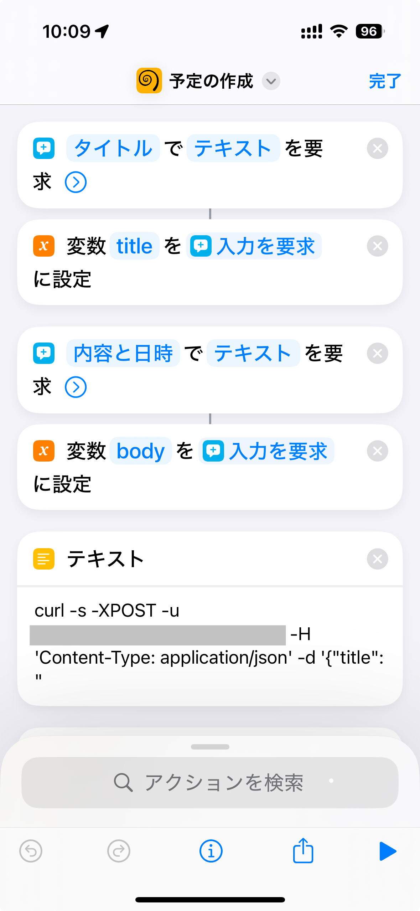
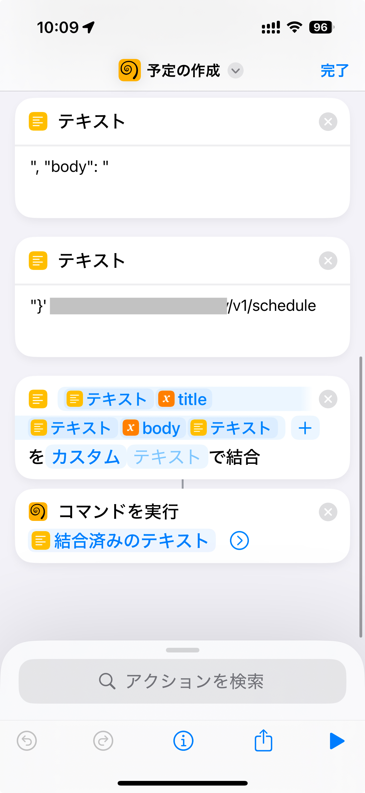

# Google Calendar Wrapper API

## About

Google Calendar Wrapper API creates a schedule with natural language in Japanese.
This script provides RESTful API interface and enables integrations for some tools.

One usecase is to use this with iOS shortcuts.

 

## Getting started (local debug)

1. Get access token from Google Cloud console

https://console.cloud.google.com/apis/api/calendar-json.googleapis.com/overview

2. Install packages

```
python -m venv env
. env/bin/activate
pip install -r requirements.txt
```

3. Set Google Calendar ID as an environment variable

```
export GOOGLE_CALENDAR_ID="xxx"
```

4. Dry-run google_calendar.py

This script creates a schedule on the Google Calendar.

```
python google_calendar.py
```

5. Start HTTP server

```
python main.py
```

6. Send an HTTP request to the server

```
curl -XPOST -u koyama:pA55word -H 'Content-Type: application/json' \
  -d '{"title": "test1", "body": "2024-12-24の12:00から14:00"}' 'http://localhost:8080/v1/schedule'
```

## Deployment

1. Create venv

```
python -m venv env
. env/bin/activate
```

2. Install packages

```
pip install -r requirements.txt
```

3. Dry-run google_calendar.py

```
python google_calendar.py
```

4. Start the app server

```
AUTH_USER=xxx AUTH_PASSWORD=xxx gunicorn main:app --bind 0.0.0.0:8080
```
